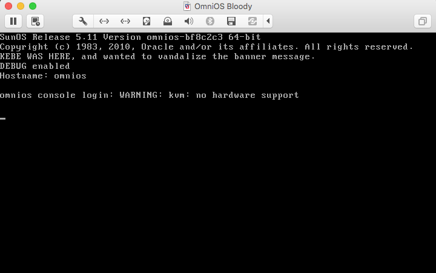

Building illumos (illumos-gate or illumos-omnios) on OmniOS
===========================================================

Starting with [r151016](ReleaseNotes/r151016.md), building [illumos-gate](https://github.com/illumos/illumos-gate) or our own
downstream [illumos-omnios](https://github.com/omniosorg/illumos-omnios) is more straightforward.

1. Have a machine or VM with a minimum of 8GB of RAM, and 10GB of free disk space
2. [Install](Installation.md) r151022 or later of OmniOS, boot it, and
   [configure it](GeneralAdministration.md) per instruction on this wiki
3. Install the single metapackage ```illumos-tools```. ```illumos-tools```
   contains compilers, closed binaries, and other tools required to build
   illumos-gate. With privilege or as root:

```
 omnios# pkg install illumos-tools
           Packages to install: 24
       Create boot environment: No
Create backup boot environment: No

DOWNLOAD                                PKGS         FILES    XFER (MB)   SPEED
Completed                              24/24   13062/13062  406.3/406.3  5.2M/s

PHASE                                          ITEMS
Installing new actions                   18479/18479
Updating package state database                 Done 
Updating package cache                           0/0 
Updating image state                            Done 
Creating fast lookup database                   Done 
omnios#
```

4. Clone the repo of your choice using git, and perform any modifications. **NOTE: For OmniOS, if you want to use the precise source of a given release, check out that branch (e.g. branch r151016 for r151016). The master branch of OmniOS corresponds roughly to bloody (master may be ahead a few commits of available bloody releases)**

```
omnios#	exit
logout
omnios(~)[0]% mkdir build
omnios(~)[0]% cd build
omnios(~/build)[0]% git clone https://github.com/omniti-labs/illumos-omnios
Cloning into 'illumos-omnios'...
remote: Counting objects: 361936, done.
remote: Total 361936 (delta 30), reused 30 (delta 30), pack-reused 361905
Receiving objects: 100% (361936/361936), 240.36 MiB | 5.37 MiB/s, done.
Resolving deltas: 100% (261121/261121), done.
Checking connectivity... done.
Checking out files: 100% (44267/44267), done.
omnios(~/build)[0]% cd illumos-omnios/
omnios(~/build/illumos-omnios)[0]% vi usr/src/uts/common/os/logsubr.c 
omnios(~/build/illumos-omnios)[0]% git diff
diff --git a/usr/src/uts/common/os/logsubr.c b/usr/src/uts/common/os/logsubr.c
index 149f5f8..0d7a66e 100644
--- a/usr/src/uts/common/os/logsubr.c
+++ b/usr/src/uts/common/os/logsubr.c
@@ -251,6 +251,7 @@ log_init(void)
            utsname.release, utsname.version, NBBY * (uint_t)sizeof (void *));
        printf("Copyright (c) 1983, 2010, Oracle and/or its affiliates. "
            "All rights reserved.\n");
+       printf("KEBE WAS HERE, and wanted to vandalize the banner message.\n");
 #ifdef DEBUG
        printf("DEBUG enabled\n");
 #endif
omnios(~/build/illumos-omnios)[0]% 
```

5. You may wish to use techniques [here](https://kebesays.blogspot.com/2011/03/for-illumos-newbies-on-developing-small.html)
   to verify your changes prior to building the entire illumos repo
6. Copy ```/opt/onbld/env/omnios-illumos-gate``` or ```.../omnios-illumos-omnios``` 
   depending on which illumos repo you're building, and modify the GATE and CODEMGR_WS
   variables to match your repo. You can also modify the NIGHTLY_OPTIONS to reduce or
   increase the amount that is built. The default is to build DEBUG & packages, plus
   lint. Call it ```$HOME/build/my.env``` for this example

```
omnios(~/build/illumos-omnios)[0]% cd ..
omnios(~/build)[0]% cp /opt/onbld/env/omnios-illumos-omnios my.env
omnios(~/build)[0]% vi my.env
omnios(~/build)[0]% diff -u /opt/onbld/env/omnios-illumos-omnios my.env
--- /opt/onbld/env/omnios-illumos-omnios	Thu Oct 29 09:38:40 2015
+++ my.env	Thu Oct 29 09:56:31 2015
@@ -30,7 +30,7 @@
 # This example is suitable for building an illumos workspace, which
 # will contain the resulting archives. It is based off the onnv
 # release. It sets NIGHTLY_OPTIONS to make nightly do:
-#       DEBUG build only (-D, -F)
+#       DEBUG and non-DEBUG builds (-D)
 #       do not bringover (aka. pull or clone) from the parent (-n)
 #       runs 'make check' (-C)
 #       checks for new interfaces in libraries (-A)
@@ -45,7 +45,7 @@
 # - This script is only interpreted by ksh93 and explicitly allows the
 #   use of ksh93 language extensions.
 #
-export NIGHTLY_OPTIONS='-FnCDAlmprt'
+export NIGHTLY_OPTIONS='-nCDAlmprt'
 
 #
 # -- PLEASE READ THIS --
@@ -58,10 +58,10 @@
 
 # This is a variable for the rest of the script - GATE doesn't matter to
 # nightly itself
-export GATE='testws'
+export GATE='illumos-omnios'
 
 # CODEMGR_WS - where is your workspace at (or what should nightly name it)
-export CODEMGR_WS="$HOME/ws/$GATE"
+export CODEMGR_WS="$HOME/build/$GATE"
 
 # Maximum number of dmake jobs.  The recommended number is 2 + NCPUS,
 # where NCPUS is the number of logical CPUs on your build system.
omnios(~/build)[1]%    
```
   
7. Run nightly.  Nightly will compile even uncommitted changes, so make sure your source reflects what you want compiled

```
omnios(~/build)[0]% /bin/time /opt/onbld/bin/nightly ./my.env 

real  1:36:57.4
user  3:54:35.1
sys     24:57.9
omnios(~/build)[0]% 
```

8. A mail should arrive to ```$LOGNAME@localhost```.  You can also check mail_msg or nightly.log in ```$CODEMGR_WS/log/log-`<date>`/```

```
omnios(~/build)[0]% cat illumos-omnios/log/log.2015-10-29.11:34/mail_msg 

==== Nightly distributed build started:   Thu Oct 29 09:57:56 EDT 2015 ====
==== Nightly distributed build completed: Thu Oct 29 11:34:54 EDT 2015 ====

==== Total build time ====

real    1:36:57

==== Build environment ====

/usr/bin/uname
SunOS omnios 5.11 omnios-b69fab3 i86pc i386 i86pc

/opt/onbld/bin/i386/dmake
dmake: illumos make
number of concurrent jobs = 6

32-bit compiler
/opt/onbld/bin/i386/cw -_gcc
cw version 1.30 (SHADOW MODE DISABLED)
primary: /opt/gcc-4.4.4//bin/gcc
gcc (GCC) 4.4.4

64-bit compiler
/opt/onbld/bin/i386/cw -_gcc
cw version 1.30 (SHADOW MODE DISABLED)
primary: /opt/gcc-4.4.4//bin/gcc
gcc (GCC) 4.4.4

/usr/java/bin/javac
openjdk full version "1.7.0_76-b31"

/usr/bin/as
as: Sun Compiler Common 12 SunOS_i386 snv_121 08/03/2009

/usr/ccs/bin/ld
ld: Software Generation Utilities - Solaris Link Editors: 5.11-1.1753 (illumos)

Build project:  group.staff
Build taskid:   82

==== Nightly argument issues ====


==== Build version ====

omnios-bf8c2c3

==== Make clobber ERRORS ====


==== Make tools clobber ERRORS ====


==== Tools build errors ====


==== Build errors (non-DEBUG) ====


==== Build warnings (non-DEBUG) ====


==== Elapsed build time (non-DEBUG) ====

real    32:32.9
user  1:24:27.1
sys      9:21.0

==== Build noise differences (non-DEBUG) ====


==== package build errors (non-DEBUG) ====


==== Build errors (DEBUG) ====


==== Build warnings (DEBUG) ====


==== Elapsed build time (DEBUG) ====

real    27:12.2
user  1:12:45.9
sys      6:39.8

==== Build noise differences (DEBUG) ====


==== package build errors (DEBUG) ====


==== Validating manifests against proto area ====


==== Check versioning and ABI information ====


==== Check ELF runtime attributes ====


==== Diff ELF runtime attributes (since last build) ====


==== 'dmake lint' of src ERRORS ====


==== Elapsed time of 'dmake lint' of src ====

real    26:20.5
user    57:18.1
sys      5:23.1

==== lint warnings src ====


==== lint noise differences src ====


==== cstyle/hdrchk errors ====


==== Find core files ====


==== Check lists of files ====


==== Impact on file permissions ====

omnios(~/build)[0]% 
```

9. Use the onu(1ONBLD) tool to create a new boot environment using your
   freshly-compiled illumos bits.  If you build both DEBUG and non-DEBUG,
   you can choose which bits.  Use beadm(1M) to make sure the BE you want
   is selected for your next reboot

```
omnios# cd ~danmcd/build
omnios# ls
illumos-omnios  my.env
omnios# beadm list
BE        Active Mountpoint Space Policy Created
omniosvar -      -          19.0K static 2015-10-29 08:48
omnios    NR     /          3.03G static 2015-10-29 08:48
omnios# ls illumos-omnios/packages/i386/
nightly     nightly-nd
omnios# /opt/onbld/bin/onu -t kebe -d ~danmcd/build/illumos-omnios/packages/i386/nightly
Created successfully
Mounted successfully on: '/tmp/onu.3ua4uQ'
Packages to remove: 3

PHASE                                          ITEMS
Removing old actions                         383/383
Updating package state database                 Done 
Updating package cache                           3/3 
Updating image state                            Done 
Creating fast lookup database                   Done 
Packages to update: 304

DOWNLOAD                                PKGS         FILES    XFER (MB)   SPEED
Completed                            304/304     2253/2253    87.1/87.1    0B/s

PHASE                                          ITEMS
Removing old actions                         304/304
Updating modified actions                  3877/3877
Updating package state database                 Done 
Updating package cache                       304/304 
Updating image state                            Done 
Creating fast lookup database                   Done 

---------------------------------------------------------------------------
NOTE: Please review release notes posted at:

http://omnios.omniti.com/ReleaseNotes
---------------------------------------------------------------------------

Activated successfully
omnios#	beadm list
BE        Active Mountpoint      Space Policy Created
omniosvar -      -               19.0K static 2015-10-29 08:48
omnios    N      /               992K  static 2015-10-29 08:48
kebe      R      /tmp/onu.3ua4uQ 3.70G static 2015-10-29 13:01
omnios#	reboot
```



